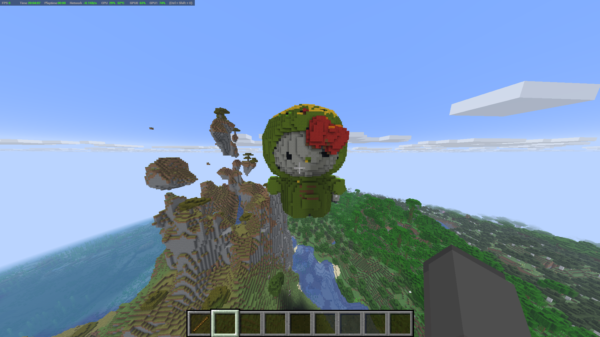

# Scan2Craft 
 I wanted to honour my favourite Hello Kitty stuffed animal in my Minecraft world with a GIANT statue...
<br>but didn't want to spend hours building it. 
<br>Scan2Craft is a Python pipeline that converts real-life scans (GLB/OBJ/PLY) into Minecraft .litematic structures.

## How it Works
Scan2Craft takes an input 3D scan, voxelizes a mesh, samples texture colours, maps colours to a customizable block palette, and exports a Litematica schematic ready to be used in Minecraft!

### Features
- Voxelizes any mesh at a chosen height
- Samples texture colours using UVs
- Maps colours to the nearest Minecraft block using CIE-LAB distance
- Exports .litematic files with litemapy
- Customizable block palette (wool, concrete, etc.)

## Example


## Installation
```bash
pip install -r requirements.txt
```

## Usage
Use the 3D scans in
```bash
/data/scans
```
 or upload a scan to the same folder (.glb, .obj, .ply).

Following this example:
```bash
python scan2schem.py \
  --mesh data/scans/helloKitty.glb \
  --height 48 \
  --out data/examples/helloKitty.litematic
```
The litematic file will be output to:
```bash
/data/examples
```
Paste into your Minecraft world using the [Litematica mod](https://www.curseforge.com/minecraft/mc-mods/litematica)!

## Tech
Python, NumPy, Trimesh, scikit-image, litemapy